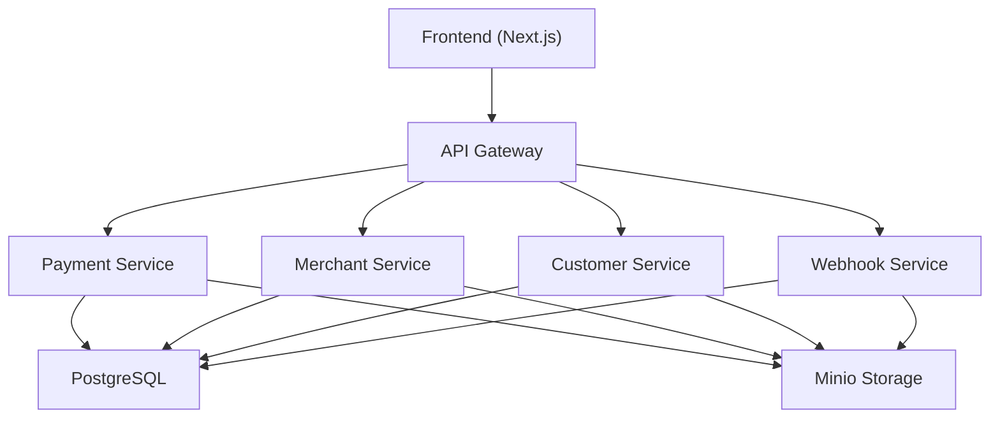
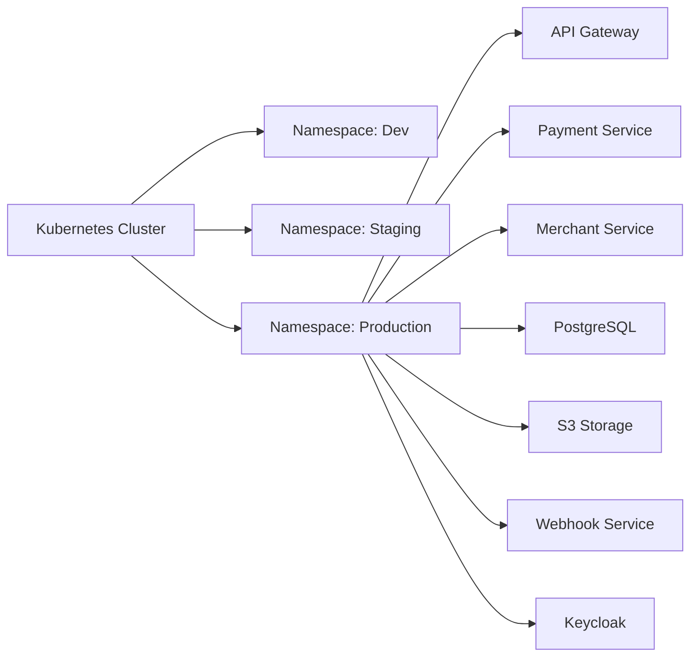

# ARC42 Template for IWYM Backend

---

## 1. Introduction and Goals

### Project Overview

This project aims to develop a **local payment processor** akin to Stripe, specifically tailored for the Cameroonian
market. The solution will empower **merchants** to accept payments via **local mobile money platforms** such as MTN
Mobile Money and Orange Money. Initially scoped as a **proof of concept (PoC)**, this system will support additional
features and services, such as **cross-border payments** and multi-tenancy, to accommodate future expansion.

The platform provides merchants with a **RESTful API** and **RPC API** for payment processing, **SDKs and plugins** for
easy integration, and a **dashboard interface** to monitor transactions, manage funds, and perform financial operations.
Our primary focus is a **scalable, secure, and cost-effective solution** that leverages cloud-native features and
integrates with **Kubernetes (EKS)** for autoscaling and resilience.

### Primary Goals

1. **Simplify Payment Integration**: Provide developers and merchants with **API and SDK tools** for easy implementation
   of mobile payments and support for plug-and-play integrations.
2. **Ensure Security**: Implement end-to-end encryption, **API key and JWT authentication**, and a **double-entry ledger
   ** for secure and traceable transactions.
3. **Scale with Demand**: Utilize Kubernetes to dynamically scale service instances, managing traffic spikes and high
   transaction volumes.
4. **Optimize Cost Efficiency**: Transition fully to **Rust-based high-performance backend** and **PostgreSQL**.
5. **Reproducible Development Environments**: Use **Docker** to ensure consistent and reproducible development setups.

### Non-Goals

- No **credit card support**: This phase focuses on mobile money payments only.
- No **international payment support**: Local transactions only; international expansion may be scoped later.

---

## 2. Constraints

### Technology Constraints

- **Backend**: Built entirely in **Rust**, supporting both REST and RPC APIs for high performance and efficiency.
- **Frontend**: Built with **Next.js** for a seamless, responsive merchant dashboard, hosted on **Vercel** or
  Kubernetes.
- **Database**: **PostgreSQL** for structured data storage, including multi-tenant support and indexing for efficient
  query performance.
- **Authentication**: **Keycloak** for robust, centralized authentication and authorization management.
- **Storage**: S3-compatible storage like **Minio** for managing immutable data such as receipts, invoices,
  proof-of-purchase PDFs, user-uploaded documents, snapshots, and backups.

### Regulatory Constraints

- **Financial Compliance**: Comply with **Cameroonian financial regulations**, including obtaining the necessary
  licenses to operate as a payment processor.
- **Data Privacy**: Ensure compliance with data protection standards (GDPR or similar) to secure customer and
  transaction data.

### Operational Constraints

- **Budget Optimization**: Use cost-effective solutions such as managed Kubernetes (AWS EKS or GKE) with optimized cloud
  infrastructure and autoscaling to meet fluctuating demand.

---

## 3. Context and Scope

### System Context

The local payment processor acts as an intermediary between **merchants** and **mobile money providers** (MTN MoMo and
Orange Money). It provides **API endpoints** for merchants to initiate transactions, a **dashboard for monitoring and
managing accounts**, and backend services to handle **webhooks, payment processing,** and **payouts**.

### Primary Actors

1. **Merchants**: Businesses or individuals utilizing the API for payment processing, integrating it with their
   platforms, and managing their funds via the dashboard.
2. **Customers**: Individuals completing payments using their mobile money wallets.
3. **Administrator**: Internal user responsible for **account validation**, handling **sandbox-to-production transitions
   **, and **merchant account management**.
4. **Payment Providers**: External systems (e.g., MTN MoMo, Orange Money) that process transactions and provide payment
   confirmations.

---

## 4. Solution Strategy

### Technology Choices

- **Backend**: Fully built in **Rust** for both REST and RPC APIs.
- **Frontend**: **Next.js** to build a dynamic, interactive dashboard with real-time transaction visibility.
- **Database**: **PostgreSQL** as the primary database, supporting structured data and multi-tenant operations.
- **Authentication**: **Keycloak** for centralized, flexible authentication and authorization.
- **Storage**: **S3-compatible storage (Minio)** for assets such as transaction records, invoices, proof of purchase,
  and backups.

### Security Strategy

1. **Authentication and Authorization**:
    - Centralized management using **Keycloak** for JWT authentication and **API key-based** access for merchants.
    - **RBAC (Role-Based Access Control)** to manage permissions across different roles (Admin, Merchant, Client).
2. **Encryption**: All communication (internal and external) secured with HTTPS and mTLS (for Kubernetes services).
3. **Input Validation and Rate Limiting**: Enforce validation to mitigate injection attacks and implement rate limiting
   to avoid abuse.

### Resilience Strategy

- **Global Error Handling**: Implement centralized error handling across services and integrate with **Sentry** for
  error tracking.
- **Auto-Scaling and Failover**: Deploy with **Kubernetes HPA** to handle scaling and **cluster failover** to improve
  availability.

### SSDLC Practices

- **Static Code Analysis**: Integrate tools like Clippy (for Rust) to enforce coding standards and catch vulnerabilities
  early.
- **Dependency Management**: Regularly update dependencies to minimize risks from third-party libraries.
- **Threat Modeling**: Conduct threat modeling exercises for critical services, focusing on payment workflows.
- **Secure Code Reviews**: Enforce mandatory peer reviews for code changes.
- **Automated Testing**: Comprehensive unit, integration, and regression tests for all services.

---

## 5. Building Block View (Architecture Overview)

### Core Components

1. **API Gateway (Rust)**:

    - Centralized service for routing API requests and enforcing authentication and authorization.
    - Routes requests to appropriate services, including **Payment Service**, **Customer Service**, and **Merchant
      Service**.

2. **Merchant Dashboard (Frontend)**:

    - Built with **Next.js** for an interactive, real-time dashboard where merchants can manage transactions, request
      payouts, and access reports.

3. **Microservices**:

    - **Payment Service**: Manages payment initiation, status checks, and error handling.
    - **Customer Service**: Manages customer actions, including payment setup and subscriptions.
    - **Merchant Service**: Handles merchant account details, API key issuance, and other business logic.
    - **Webhook Service**: Dedicated service for sending real-time notifications to external systems.

4. **Database (PostgreSQL)**:

    - Primary storage with support for structured data, multi-tenancy, and full-text search.

5. **Storage Service (Minio)**:

    - Stores immutable data such as receipts, invoices, proof-of-purchase PDFs, user-uploaded documents, and backups.

### Component Diagram

---

## 6. Runtime View

### Example Workflow: Payment Process

1. **Merchant Setup**: A merchant creates an account, obtains API credentials, and configures payment settings.
2. **Payment Initiation**:
    - A customer initiates payment via the merchant’s platform, triggering an API call to the **Payment Service**.
    - The **API Gateway** routes the request to the appropriate service.
3. **Payment Processing**:
    - Upon confirmation, the transaction is recorded in the **PostgreSQL ledger**, maintaining a double-entry for debit
      and credit.
    - The **Payment Service** sends a real-time update to the merchant's dashboard and, if applicable, a webhook to
      external systems.

### Runtime Diagram

---

## 7. Deployment View

### Infrastructure Components

1. **Kubernetes Cluster**: EKS or GKE, with separate namespaces for dev, staging, and production.
2. **Service Pods**: Each microservice (e.g., Payment Service, Webhook Service) is deployed as a separate pod, managed
   by Helm.
3. **PostgreSQL**: Cloud-hosted database (Neon.tech for PoC, AWS RDS for production).
4. **S3 Storage (Minio)**: S3-compatible storage for immutable data management, optionally connected to a CDN.
5. **Authentication**: **Keycloak** for centralized user and service authentication.

### Deployment Diagram

---

## 8. Cross-Cutting Concerns

### Security

- **API Security**: JWT for user access, API keys for merchant integrations, and secure header validation.
- **Encryption**: HTTPS for all data transfer, with mTLS within Kubernetes for secure service-to-service communication.
- **RBAC**: Permissions tailored for admins, merchants, and clients.

### Logging and Monitoring

- **Sentry**: Captures errors and exceptions for debugging.
- **Prometheus and Grafana**: Used to monitor database performance, API response times, and memory/CPU utilization for
  each pod.

### Error Handling

- **Global Error Handling**: Centralized error handling for all services.
- **Circuit Breakers**: Prevents cascading failures in case of issues with external payment providers.

### SSDLC Practices

- **Automated Code Scans**: Integrate tools like RustSec for dependency analysis.
- **Runtime Security Monitoring**: Use Falco or similar tools to detect abnormal behavior in Kubernetes.
- **Periodic Penetration Testing**: Ensure external-facing services are secure against known vulnerabilities.

---

## 9. Architectural Decisions

1. **Rust for Backend**: Ensures high performance, low memory usage, and secure code.
2. **PostgreSQL as Main Database**: Structured data storage with multi-tenant support, using schema separation for
   tenant data.
3. **Minio for Storage**: S3 compatibility for immutable asset management, simplifying CDN integration.
4. **Helm and Kubernetes**: Effective for managing different environments (dev, staging, production) with easy scaling.

---

## 10. Quality Requirements

### Performance

- **Response Time**: Average API response within 200-300ms.
- **Scalability**: Scale pods horizontally based on demand.

### Security

- **Data Encryption**: HTTPS and mTLS within Kubernetes.
- **Regular Audits**: Security audits for code and infrastructure.

### Availability

- **Target**: 99.9% uptime, leveraging Kubernetes autoscaling and failover mechanisms.

---

## 11. Risks and Technical Debt

1. **Dependency on Payment Providers**: Reliance on MTN and Orange APIs may introduce availability risks.
2. **Scaling PostgreSQL**: Potential performance limitations as data grows, requiring sharding or indexing strategies.
3. **Eventual Consistency**: Asynchronous processing could lead to temporary inconsistencies; monitoring and retries are
   required.

---

## 12. Glossary

- **MoMo**: MTN Mobile Money service for local transactions.
- **Double-entry Ledger**: System to log each transaction with both debit and credit for accuracy.
- **Merchant**: Business entity using the platform for payment processing.
- **Payout**: Process by which funds are transferred from the platform to the merchant.